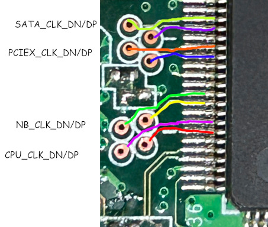

# Register dump of ANA (defaults)

Maybe ideas for Xenon stuff?

ANA is accessible over I2C at address 0x70, same as HANA.

The ANA has clock generators that weren't used in production as they were too unstable.
~~Maybe they could be reenabled and abused.~~ It looks like they may be disabled at the
die level - can't confirm this, but only a subset of registers compared to HANA can be
accessed. Unless there's a magic "enable the clock generators" register somewhere,
I doubt this approach will work.

| Register | Length | Contents    |
| -------- | ------ | ----------- |
| 0xD0     | 0x04   | 9D 5A 05 00 |
| 0xD1     | 0x04   | 9F 4A 1F 00 |
| 0xD2     | 0x04   | 1F FE 2C 00 |
| 0xD3     | 0x04   | 18 52 20 00 |
| 0xD4     | 0x04   | 17 5A 11 00 |
| 0xD5     | 0x04   | 0F 00 00 00 |
| 0xD5     | 0x04   | 0F 00 00 00 |
| 0xD6     | 0x04   | 0F 00 00 00 |
| 0xD7     | 0x04   | 0F 00 00 00 |
| 0xD8     | 0x04   | 0F 00 00 00 |
| 0xD9     | 0x04   | 00 EE 01 00 |
| 0xDA     | 0x04   | 02 00 00 00 |
| 0xDB     | 0x04   | 02 00 00 00 |
| 0xDB     | 0x04   | 02 00 00 00 |
| 0xDC     | 0x04   | AA 42 00 00 |
| 0xDD     | 0x04   | FF FF FF FF |
| 0xDE     | 0x04   | FF FF FF FF |
| 0xDF     | 0x04   | FF FF FF FF |
| 0xE0     | 0x04   | 00 00 00 00 |
| 0xE1     | 0x04   | 8A AE 00 00 |
| 0xE2     | 0x04   | 00 00 00 00 |
| 0xE3     | 0x04   | FF FF FF 0F |
| 0xE4     | 0x04   | 1B 00 00 00 |
| 0xFE     | 0x04   | 01 00 00 00 |
| 0xFF     | 0x04   | 00 00 00 00 |

Unused outputs and test pins:

